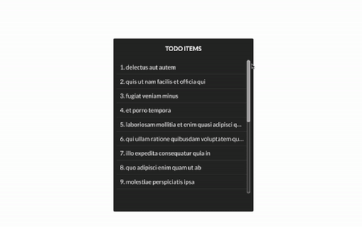
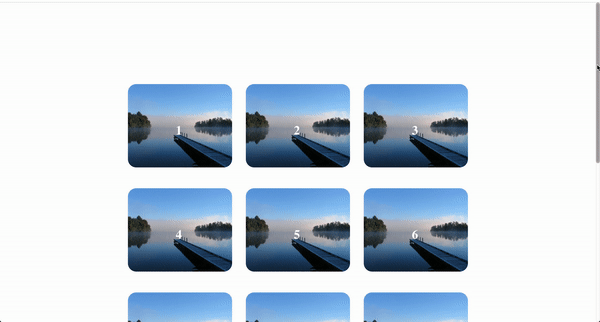
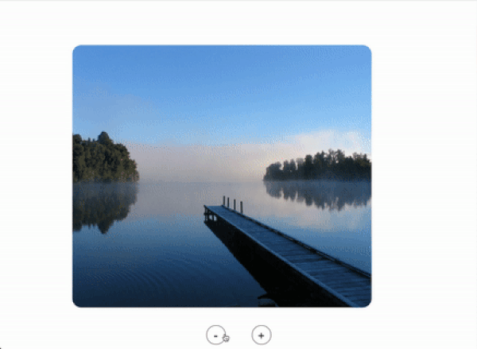
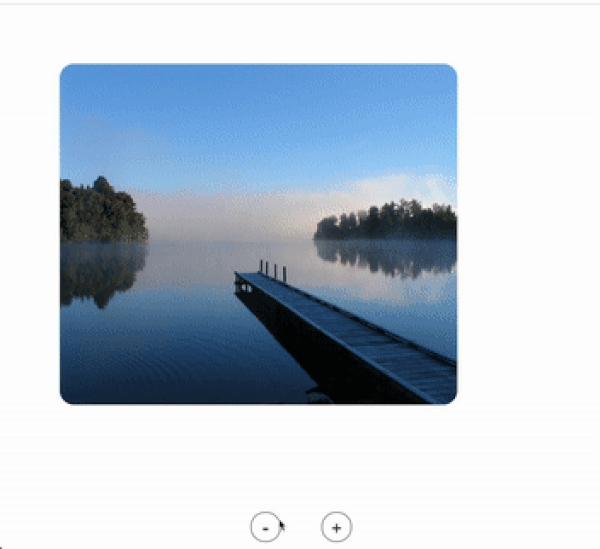
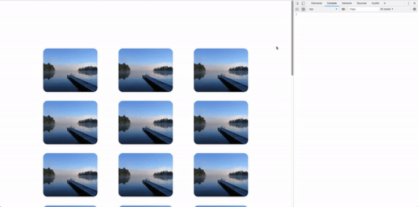

<p align="center" style="font-size: 1.2rem;">
    Observe changes in the intersection of a target element.
</p>


>React component to observe changes in the intersection of a target element or within the document's viewport
by using [**Intersection Observer API**](https://developer.mozilla.org/en-US/docs/Web/API/Intersection_Observer_API).

Intersection information for a react component is needed for many reasons and can be used as:

 * [Infinite scrolling](#Usage) of web sites, where more and more content is loaded and rendered as scrolled,
 * [Lazy loading](#Usage) of images or other content as the page is scrolled,
 * [Controlling elements](#Usage) in-viewport, in case of their loss of visibility,
 * [Performing tasks or animations](#Usage) based on whether or not the user will see the result,
 * [Reporting advertisements' visibility](#Usage) in order to calculate ad revenues.

# Installation

```sh
npm install react-dev-comps.intersection-observer --save
```

# Usage

* Using as `infinite-scroller`:

Place it as the latest item in list and execute fetch handler on your onEnter callback.

```js
import InfiniteScroller from 'react-dev-comps.intersection-observer';

<div className="list-container">
    <div className="each-todo-item" />
    <div className="each-todo-item" />
    <div className="each-todo-item" />

    { /*... any other items ...*/ }

    <InfiniteScroller onEnter={this.fetchNextList}/>
</div>
```



* Using as `lazy-loader`:

Place it as the latest item in list and execute image handler on your onEnter callback.

```js
import LazyLoad from 'react-dev-comps.intersection-observer';

// Since we have 3 images on each row, not to broke style, we used targetStyle prop.

<div className="image-container">
    
    
    

    { /*... any other images ...*/ }

    <LazyLoad
        targetStyle={{ width: "100%", height: "0" }}
        onEnter={this.getNextImages}
    />
</div>
```



* Using as `inview-controller`:

Lets say we have an image and zoom-control buttons to zoom in/out.
When zoomed in/out, image may be lost from viewport. (as an implementation side-effect)

```js

<div className="app">
    <ImageContainer />
    <ZoomController />
</div>
```



To overcome this issue, wrap the image with InViewController component and
reset the image position on your onLeave callback.

```js
import InViewController from 'react-dev-comps.intersection-observer';

<div className="app">
    <InViewController onLeave={this.resetImagePosition}>
        <ImageContainer />
    </InViewController>
    <ZoomController />
</div>
```



* Using as `task-performer`:

Wrap the video container with InViewController component and
perform your tasks/animations on your onEnter and onLeave callbacks.

```js
import InViewController from 'react-dev-comps.intersection-observer';

<div className="app">
    <InViewController
        onEnter={this.playVideo}
        onLeave={this.pauseVideo}
    >
        <VideoContainer />
    </InViewController>
</div>
```


* Using as `ads-visibility-timer`:

Wrap the AdvertisementPanel with InViewController component and
start/stop your timers on your callbacks.

```js
import InViewController from 'react-dev-comps.intersection-observer';

<div className="app">
    <InViewController
        onEnter={this.startTimer}
        onLeave={this.stopTimer}
    >
        <AdvertisementPanel />
    </InViewController>
</div>
```



# API

`react-dev-comps.intersection-observer` exposes a React Component which takes the following props:

* `onIntersect`: A *cb*, invoked when target element intersects with the root. (either intersecting *in* or *out*)
* `onEnter`: A *cb*, invoked when target element is visible within the root element. (or viewport)
* `onLeave`: A *cb*, invoked when target element has lost visibility within the root element. (or viewport)
* `onUpdate`: An *array* of variables which **must** be described when any of your callbacks are using any kind of data.
Variables **must** be the datas you are using on your callbacks. [Example](#Extra-Use-Cases)
* `options`: An *object* passed to
[IntersectionObserver()](https://developer.mozilla.org/en-US/docs/Web/API/IntersectionObserver/IntersectionObserver)
constructor to let you control the circumstances for invocation of observer's callbacks. Defaults to *{root: null, rootMargin: '0', threshold: 1}*
* `targetClass`: A *string* class name for target element. Defaults to *"intersection-target"*
* `targetStyle`: An *object* for inner styling target element. Defaults to *empty object*
* `children`: A *react children* component which will be the child of the intersection target element. Defaults to *null*

Callbacks will be invoked with 2 arguments.
 * [IntersectionObserverEntry](https://developer.mozilla.org/en-US/docs/Web/API/IntersectionObserverEntry)
 * [IntersectionObserver](https://developer.mozilla.org/en-US/docs/Web/API/IntersectionObserver)

# Extra Use Cases

1) Let's say, you're depending on some data (variables, props, state-variables etc.) on any of your callbacks.
For that situation, you **must** provide those variables as **onUpdate** elements to use those variables' latest/updated
versions on your callbacks. If you don't use onUpdate prop as required, your callbacks will always be executed
with the initial values of those variables.

    ```js
    import InfiniteScroller from 'react-dev-comps.intersection-observer';

    <div className="list-container">
        <div className="each-todo-item" />
        <div className="each-todo-item" />
        <div className="each-todo-item" />

        { /*... any other items ...*/ }

        // We need fresh versions of *anyPropVariable* and *anyStateVariable* datas.
        <InfiniteScroller
            onEnter={() => {
                if (this.props.anyPropVariable) {
                    // do someting...
                }

                if (this.state.anyStateVariable) {
                    // do someting...
                }
            }}

            // We **must** provide those variables on our onUpdate array prop.
            onUpdate={[ this.props.anyPropVariable, this.state.anyStateVariable ]}
        />
    </div>
    ```

2) Let's say, you have to execute some essential tasks (fetching new items and append to the list)
and some background tasks which are non-essential to be completed priorly. For that situation,
`react-dev-comps.intersection-observer` also exposes [background-tasks-api](https://github.com/alisaitbilgi/background-tasks-api)
with the method name *scheduleTasksOnBackground*.
Although it is a standalone package on [npm](https://www.npmjs.com/package/background-tasks-api), you can import and use it as:

    ```js
    import InfiniteScroller, { scheduleTasksOnBackground } from 'react-dev-comps.intersection-observer';

    var nonEssentialWork1 = () => { /* do something */ };
    var nonEssentialWork2 = () => { /* do something */ };
    var tasks = [ nonEssentialWork1, nonEssentialWork2 ];

    <div className="list-container">
        <div className="each-todo-item" />
        <div className="each-todo-item" />
        <div className="each-todo-item" />

        { /*... any other items ...*/ }

        <InfiniteScroller
            onEnter={() => {
                scheduleTasksOnBackground(tasks); // non-essential tasks will be executed on idle callbacks.
                this.fetchNextList(); // free to execute prior tasks on main thread.
            }}
        />
    </div>
    ```

# License

Licensed under the MIT License, Copyright © 2019-present.

See [LICENSE](./LICENSE) for more information.
